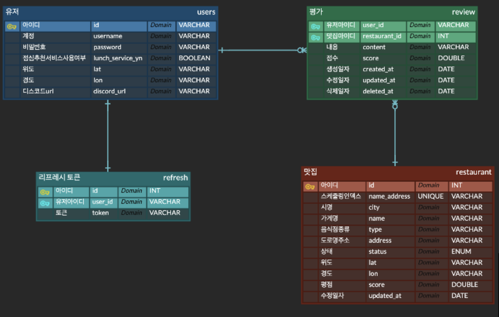
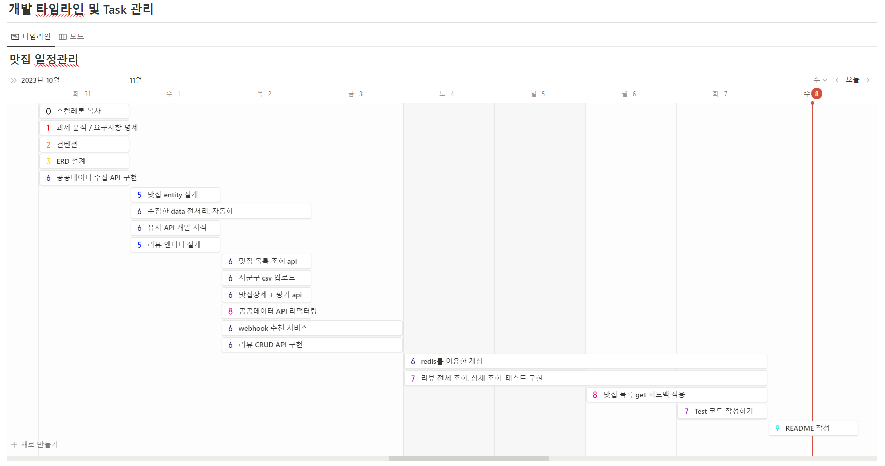
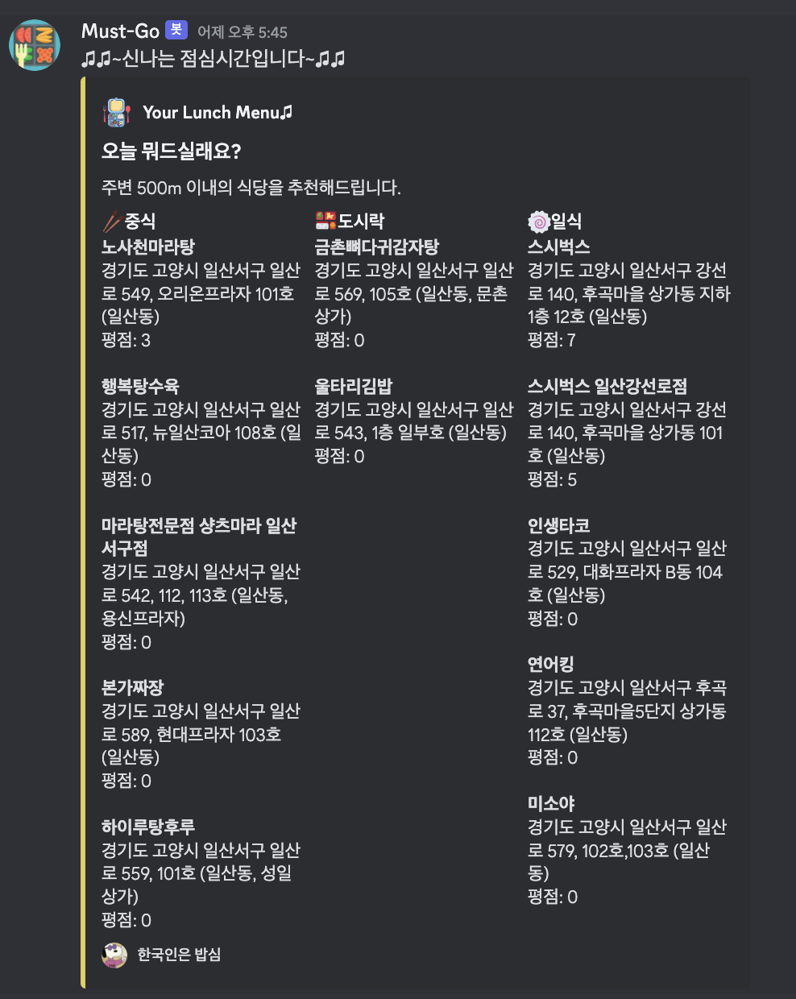

<div align="center">
  
</div>
# 지리기반 맛집 추천 웹 서비스

**내 위치 또는 지정한 위치 기반으로 맛집을 추천합니다**
본 서비스는 공공데이터를 활용하여, 지역 음식점 목록을 자동으로 업데이트 하고 이를 활용합니다. 사용자 위치에맞게 맛집 및 메뉴를 추천하여 더 나은 다양한 음식 경험을 제공하고, 음식을 좋아하는 사람들 간의 소통과 공유를 촉진하려 합니다.

<br/>

## Table of Contents

- [개요](#개요)
- [API Reference](#api-reference)
- [ERD](#ERD)
- [프로젝트 진행 및 이슈 관리](#프로젝트-진행-및-이슈-관리)
- [구현과정(설계 및 의도)](<#구현과정(설계-및-의도)>)
- [TIL 및 회고](#til-및-회고)
- [Authors](#authors)

<br/>

## 개요

당신의 위치를 기반으로 최고의 음식 체험을 제공하는 이 서비스는 공공데이터를 활용하여 지역별 음식점 정보를 매주 업데이트합니다. 더 나아가, 사용자의 위치에 따라 개별화된 맛집과 메뉴 추천을 제공하며, 이를 통해 사용자들은 새로운 맛의 세계를 경험할 수 있게 됩니다.

이 서비스는 단순히 정보 제공에 그치지 않고, 음식을 사랑하는 사람들 사이의 소통과 공유의 장을 마련합니다. 사람들은 자신이 방문한 맛집의 후기를 남기고 다른 사람들의 평가를 통해 새로운 음식점을 발견할 수 있습니다. 이 과정에서 다양한 음식 문화와 맛의 세계를 탐험하고, 음식에 대한 새로운 이해와 즐거움을 발견하게 됩니다.

이러한 서비스는 사용자들에게 평범한 식사 시간을 넘어서는 특별한 경험을 제공합니다. 각자의 위치에 맞는 최적의 점심맛집과 메뉴를 찾아내는 것은 물론, 추천맛집 알림 기능을 통하여 사람들과 음식에 대한 이야기를 나누며 행복한 경험을 만들어가는 과정을 제공합니다. 이를 통해, 우리의 서비스는 단순한 맛집 추천 서비스를 넘어서, 사용자들의 음식에 대한 풍부한 경험과 공유의 장을 제공하는 플랫폼으로 성장하고 있습니다.
<br/>

<br/>

## Skils

<div align="center">

언어 및 사용 도구 <br/>     
<br/>
데이터 베이스 <br/> <br/>

</div>

<br/>

## Directory

<details>
<summary> 파일 구조 보기 </summary>

```
src
├─auth
│  ├─dto
│  └─entities
├─cache
├─common
│  └─decorator
├─config
├─region
│  ├─data
│  └─utils
├─restaurant
│  ├─dto
│  ├─entities
│  ├─pipes
│  ├─test
│  └─types
├─review
│  ├─dto
│  └─entities
├─user
│  ├─dto
│  ├─entities
│  └─test
├─util
└─webhook
```

기존 node.js 프로젝트 폴더구조는 src/controller내에 userController, postController 등 파일들을 모아두고, src/service내에 userService, postService 방식이었습니다. 그러나 이 방식의 문제점은 유지 보수를 할때, user에 관한 controller, service, repository 파일을 여는 상황이 많았고, controller, service 폴더 내에 불필요한 파일까지 있어 관심 있는 것에 집중하기 어려웠습니다. 결과적으로 폴더 구조를 user, restaurant 등으로 관심사끼리 묶어 controller, service, repository 등으로 분류 했습니다.

</details>
</br>

## API Reference

Swagger : http://localhost:{port}/swagger#/


<br/>

## ERD


<br/>

## 프로젝트 진행 및 이슈 관리

[](https://www.notion.so/dev-j/6a83f5bfa7874dc49e4fac30653aaa53?v=25c6ca9163064a8c879dcf124a914f29&pvs=4)

[프로젝트 관리 페이지](https://www.notion.so/dev-j/must-Go-077b850837b743fbbbd59cc33a7e51ca?pvs=4)



<br/>

## 구현과정(설계 및 의도)

<details>
<summary>공공데이터 수집/전처리/자동화 고려사항 - click</summary>

- **수집**

  1. 데이터 수집 방법: 경기도의 음식점 데이터를 수집하기 위해 HttpModule을 활용하여 공공 데이터의 OPEN API를 호출했습니다.
  2. 데이터 양 및 저장 제한 고려: 한 번의 호출로 얻을 수 있는 양이 제한적이었으며, 한 번에 DB에 저장 가능한 양도 제한이 있었습니다. 따라서 1000개씩 데이터를 불러와 전처리를 진행 후 저장하는 방식을 선택했습니다.
  3. 데이터 수집 반복: API 응답에 포함된 총 데이터 수(totalCount)를 활용하여 모든 데이터를 수집하기 위한 반복문을 설계했습니다.

- **전처리**

  1. 중복 데이터 방지: 중복 데이터 저장을 방지하기 위해 Set과 map을 활용하였습니다.
  2. 고유 컬럼 생성: 상호명(name)+주소(address)+업태(type)를 결합하여 고유한 컬럼을 생성했습니다. 이를 통해 동일한 매장의 중복 저장을 방지했습니다.
  3. 데이터 정제: 필수 정보인 위도, 경도, 주소가 null인 데이터는 필터링하고, 다른 항목의 null값은 '미확인'으로 처리했습니다.

- **자동화**
  1. 스케쥴링 설정: 매주 금요일로 공데이터를 업데이트는 스케쥴링 작업을 설정하였습니다. 서버 시작 시에 스케쥴링 작업을 등록고, 매주 금요일 오전 1시에 자동으로 동작합니다.
  2. 공공데이터 API 호출: 스케쥴링 작업이 동작 후, 공공데이터 API를 호출하여 최신 음식점 데이터를 JSON형식으로 받아옵니다.
  3. 데이터 전처리: 위에서 설명한 데이터 전처리를 거쳐서 필요한 데이터만을 추출 합니다.
  4. DB 업데이트: 기존에 있는 음식점의 정보가 바뀌면 업데이트하고, 새로운 음식점이면 새로운 레코드를 추가합니다. 이를 통해 자동으로 데이터를 업데이트하여, 사용자에게 최신의 음식점 정보를 제공합니다.

</details>

<details>
<summary>유저 등록 - click</summary>

- **회원가입**

  1. `계정`은 유저의 id를 기입

  - 계정 생성시 테이블에 Trigger로 유저의 id가 생성되며 [US + yyMMdd + 4자리의 일련번호] 형식으로 생성

  2. `비밀번호`는 아래와 같은 `제약 조건`을 가지며, `암호화`하여 데이터베이스에 저장

  - 비밀번호는 최소 10자 이상
  - 숫자, 문자, 특수문자 3가지를 포함해야합니다.

- **로그인**
  1. 계정, 비밀번호로 로그인 시 JWT토큰이 발급됩니다.
  2. JWT 토큰은 Access token과 Refresh token 두개가 발급됩니다.
  - 이 떄 Refresh token은 유저 테이블에 저장되며 보안을 위해 해싱하여 저장됩니다.
  3. 이후 게시물, 통계 API 요청 Header에 Access token가 항시 포함되며, JWT 유효성을 검증합니다.
  4. Aaccess token 만료시 Refresh token을 포함하여 재발급 요청시 Refresh 유효성 검증 후 Access토큰을 재발급합니다,
  </details>

<details>
<summary>맛집 목록 조회 -click</summary>

- **시군구 조회**

  1.  앱 실행시 파일내에 공공데이터 파일인 csv 파일을 읽어 json 형태로 변형 후 Redis 캐시 메모리에 저장됩니다.
  2.  이 후 지역 데이터 api 호출시 Redis 캐시 메모리에서 데이터를 불러옵니다.

- **범위 내 맛집 목록 조회**
  관련 TIL : [현재 point와 맛집 간의 거리를 구할 때](https://www.notion.so/dev-j/point-46552805e08f4bb2923c1aeaed005130?pvs=4)
  1. 하버사인 공식을 이용해서 raw query를 통해 쿼리로 들어온 point와 맛집 간의 거리를 계산하였습니다.
  2. 쿼리로 들어온 range에 맞는 사각형을 기준으로 데이터를 우선 필터링하여 불러와 거리 계산 횟수를 줄였습니다.

</details>

<details>
<summary>맛집 상세 조회, 리뷰 생성, 업데이트 - click</summary>

- **맛집상세 조회**

  1. 맛집의 모든 필드 정보를 조회할 수 있습니다.
  2. 리뷰 점수, 내용도 포함되어 조회됩니다.
  3. 리뷰는 생성시간 역순(최신순)으로 반환합니다.

- **맛집 리뷰 생성, 수정, 삭제**

  1. 리뷰 엔터티에 유저 엔터티, 맛집 엔터티를 조인하여 외래키를 생성했습니다.
  2. 맛집 리뷰 생성, 수정, 삭제하면 평점이 업데이트 되도록 구현
  3. 트랜잭션 격리 수준은 `COMMITED READ`로 결정했습니다. 왜냐하면 이 서비스에서 `일시적인 불일치`는 큰 문제가 되지 않을 것 같고 `성능적인 이점`이 더 중요하다고 생각했기 때문입니다.

- **유명맛집 캐시 데이터 저장**
  1. 사용자가 맛집 상세 조회를 요청시 캐싱 시스템을 확인 합니다.
  2. 캐싱 시스템은 먼저 해당 맛집 id를 키값으로 캐시에 저장되어 있는 데이터를 확인합니다.
  3. 평균 평점 4점 이상인 맛집들의 정보는 캐시에 저장되어 있습니다. 캐시 데이터가 있다면 정보를 빠르게 가져와 사용자에게 제공합니다. `평점 4점 이상`의 맛집은 사용자들의 높은 관심을 받는 데이터이기 때문에, 이러한 맛집 정보들을 캐시에 저장함으로써 서비스의 `반응 속도를 향상`시킵니다.

</details>

<details>
<summary>Discord Webhook을 활용한 점심 추천 서비스 - click</summary>

- **서비스 소개 및 로직**

  1. 유저 중 점심 추천 서비스 사용여부를 체크한 유저에 한해, 점심시간 30분전(11:30 am) 주변 맛집 리스트를 제공한다.
  2. 500 미터 이내의 맛집을 카테고리별로 5개씩 제공한다.

  - 맛집 type별(중식, 한식, 일식)
  - 평점(score) 높은 5개의 식당

  3. @nestjs/schedule의 cron을 통헤 스케줄 등록

- **유저 대상자 조회**

  1. 점심 추천 서비스를이용하는지 여부가 담긴 컬럼 `[user]lunch_service_yn`이 `true`인 유저
  2. 유저 개인이 등록한 디스코드 웹훅 url을 담고 있는 컬럼 `[user]discord_url`이 `''`(빈 스트링 값)이 아닌 유저

- **거리 계산**

  1. 사각형 거리 범위(bounding box)의 위경도를 가진 식당만 DB에서 조회
  2. 1번에서 조회된 식당을 for문 순회하며 유저 위경도 - 식당 위경도 사이 거리를 계산 -> 500미터 이하의 식당만 리스트화

- **메시지 가공 후 전송**

  1. 디스코드 웹훅 메시지 포맷으로 완성
  2. @nestjs/axios 사용하여 유저의 디스코드 웹훅 url로 post 요청



</details>

<br/>

## TIL 및 회고

### [TIL / 코드리뷰 (Notion)](https://dev-j.notion.site/TIL-8af747d00cbb46778720f3d46f19638c?pvs=4)

- [save? upsert? 1편](https://www.notion.so/dev-j/save-upsert-1-0fbf87344dfc4531a1d1fb5867f87554?pvs=4)
- [save? upsert? 2편](https://www.notion.so/dev-j/save-upsert-2-e283914f0e9c42c6954a8a01eb4cc7bc?pvs=4)
- [authentication & authorization](https://www.notion.so/dev-j/authentication-authorization-0d28b81b14204cdf8098df64db62e124?pvs=4)
- [기본키 생성 전략](https://www.notion.so/dev-j/e601ed909781473e90f7feb4d10ec8c6?pvs=4)
- [@Module에서 ConfigService 사용하기](https://www.notion.so/dev-j/Module-ConfigServcie-ff0cd4f2fb86416883392ba014d6e5a4?pvs=4)
- [대량의 데이터 저장 시 오류 driverError](https://www.notion.so/dev-j/driverError-error-bind-message-has-32159-parameter-formats-but-0-parameters-e96dc5a37c7842a1ac28b7e95f4007ac?pvs=4)
- [save vs update](https://www.notion.so/dev-j/save-vs-update-4a911f945a7844e88e7fe453b9cf8f31?pvs=4)
- [Redis의 세계로](https://www.notion.so/dev-j/Redis-3f4f1fad446343178fb15091af309baa?pvs=4)
- [Transaction](https://www.notion.so/dev-j/Transaction-79e9578bc3c54a8ab9e6124ba8ffd0f6?pvs=4)
- [Swagger JWT 왜 안돼?](https://www.notion.so/dev-j/Swagger-JWT-1b91463e9562415dbb5154d0ea895393?pvs=4)
- [현재 point와 맛집 간의 거리를 구할 때](https://www.notion.so/dev-j/point-46552805e08f4bb2923c1aeaed005130?pvs=4)
- [테스트 코드(jest) : 절대경로 오류](https://www.notion.so/dev-j/4aab3b9708354ef8a0e63982e29df6ed?pvs=4)

<br/>

## Authors

<div align="center">

</br>


<a href="https://github.com/u00938">김유영</a> <a href="https://github.com/keeepmin94">유지민</a> <a href="https://github.com/enxxi">이은석</a> <br/>
<a href="https://github.com/J-A-Y2">정재훈</a> <a href="https://github.com/wonn23">허창원</a>

</div>
<br/>
